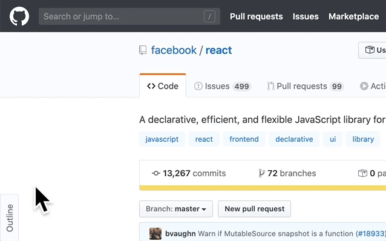

 

# markdown-outline-for-github

Chrome extensions that shows markdown outline quickly.

## Install

- [Chrome web store]()

## Features

- Displaying markdown outline on the GitHub and Gist.

## License

[MIT License](http://ja.wikipedia.org/wiki/MIT_License)
(c) [mitsuruog](https://github.com/mitsuruog)
